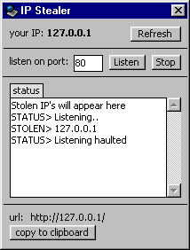



## Simple IP Stealer \- Uses Winsock

### Description

Small project listens for incoming requests, then steals the IP. Give your friends or anybody a URL (your IP) - then steal their password! You can change the port to listen on, and the data that is sent when the user connects. Very simple, less than 50 lines of code. Please vote if you find this useful :) ANY feedback, negative or positive, is greatly appreciated. BTW - I know there's already like 800 of these on PSC, but I thought I'd post my own. I was messing around with Winsock and thought this would be a neat project for beginners.
 
### More Info
 

             |
---                |---
**Submitted On**   |2000-11-19 12:05:44
**By**             |[Patrick Moore \(Zelda\)](https://github.com/Planet-Source-Code/PSCIndex/blob/master/ByAuthor/patrick-moore-zelda.md)
**Level**          |Beginner
**User Rating**    |3.0 (9 globes from 3 users)
**Compatibility**  |VB 5\.0, VB 6\.0
**Category**       |[Miscellaneous](https://github.com/Planet-Source-Code/PSCIndex/blob/master/ByCategory/miscellaneous__1-1.md)
**World**          |[Visual Basic](https://github.com/Planet-Source-Code/PSCIndex/blob/master/ByWorld/visual-basic.md)
**Archive File**   |[CODE\_UPLOAD1183811192000\.zip](https://github.com/Planet-Source-Code/patrick-moore-zelda-simple-ip-stealer-uses-winsock__1-12943/archive/master.zip)

